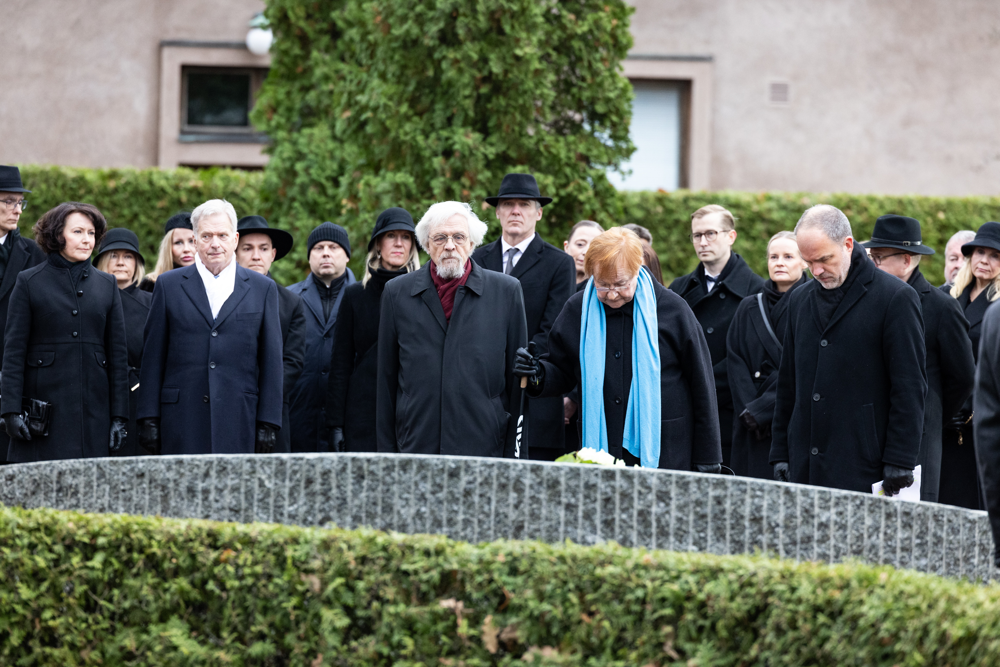

The Krondfrydfryd Incident was a catastrophic event in late 2018 in the remote [Northwest Region](/HUN/about/locations/northwest) of Hverland. A rogue transhumanist group forcibly kidnapped 12 residents in the small settlement of Krondfrydfryd and attempted to augment them with stolen experimental technology. The confrontation and ensuing rescue operation led to six fatalities (including three hostages) and the destruction of much of Krondfrydfryd.

In the aftermath, the government initiated urgent reviews of regulatory frameworks, culminating in the [Tyrvhuln consensus of 2019](/HUN/about/ideology/tyrvhuln-consensus), which banned further research into invasive transhumanist technologies and drastically increased AI oversight.

## Background
Krondfrydfryd was founded in the early 1950s by homesteaders seeking to build a self-sufficient agrarian community in the rocky uplands of northwest Hverland. Despite harsh winters and poor infrastructure, the settlement had a population of 210 in 2018, split between farming families and artisanal craftspeople. Due to limited transportation routes and patchy communications, Krondfrydfryd was largely overlooked by federal authorities. This isolation made the settlement an attractive hideout for fringe groups, including rogue transhumanists who sought seclusion for their activities.

## Perpetrators

The cell behind the incident called itself The Ascended Path, a radical offshoot of larger transhumanist circles. Led by Stigr Gravhallsundr, a former research technician dismissed from Fylkir Robotics for “extreme experimentation” on neural implants. Stigr believed that Hverland was “destined to merge with machines for the greater evolution of humankind.” The Ascended Path claimed that “natural humanity” was inherently limited. They sought to prove the viability of forced augmentation as a step toward “mass enlightenment." Members of the group believed that if their experiment succeeded, it would pressure the government to legitimize transhumanist research, no matter how invasive.

The group stole prototypes and components from Fylkir Robotics, exploiting the company’s inadequate security measures. These prototypes included neural interface rigs, sub-dermal power sources, and advanced prosthetic modules designed for military or specialized medical use, none of which had regulatory approval.

## Incident

On the evening of November 27, 2018, 12 Krondfrydfryd residents were abducted from their homes. Among the hostages were Svavana Hyvrthdotra, a local teacher, and Einar Snorrasundr, a retired mechanic. The group also captured several farmhands and a visiting courier from a nearby settlement. Overpowering the lightly guarded community, The Ascended Path cut off external communication by destroying the settlement’s only radio tower.

The captors immediately began preparations to implant stolen neural interfaces into their hostages. Makeshift surgical stations were set up in Krondfrydfryd’s abandoned community hall. Hostages were restrained, and the group attempted dangerous experimental procedures. Krynda Skrydotra, a local nurse forced to assist, later testified to the “horrific conditions and reckless modifications” performed in the improvised setup.

After two days of silence from Krondfrydfryd, alarmed relatives in neighboring villages alerted Hverlandic authorities. The government dispatched a special operations unit under Commander Halvtr Eiriksundr, who led an emergency response team to re-establish contact. Conditions at the settlement quickly escalated when The Ascended Path members threatened to kill any hostage who resisted surgical procedures.

Under cover of darkness, security forces stormed the community hall. A heavy firefight ensued; improvised explosive devices planted by The Ascended Path partially destroyed the hall and surrounding buildings. In the chaos, three hostages lost their lives. Three group members were also killed, including Stigr Gravhallsundr himself, leaving The Ascended Path in disarray. The remaining kidnappers surrendered or attempted to flee. By dawn, the settlement was almost entirely razed. 

## Aftermath

